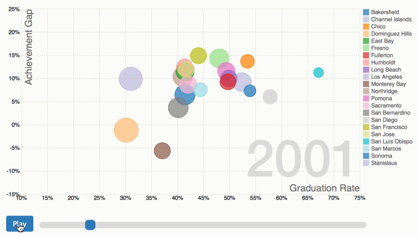
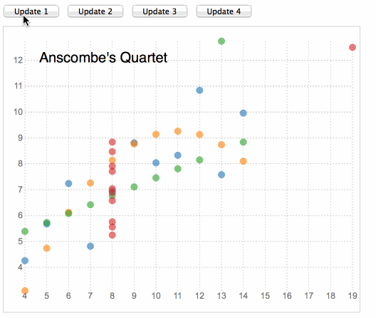

#Class 12: Project Reviews

##Final Project
#### Motion Chart
D3 Time Series Chart using Mike Bostock's [Wealth and Health of Nations] (https://bost.ocks.org/mike/nations/) chart as a template. Added a start button and slider using jquery and html5 range slider to control the animation. Click on image below to go to chart.
[] (http://bl.ocks.org/keboice/raw/037f7ac2089bbe455e86140d24bdefc9/)

##Class Projects
Below is a review of the vizualizations we completed over the course of the last six weeks. Click on the images to visit the charts.

###Scatterplot/Transition Exercises
#### Dancing Ansombe's

#### Baseball Scatterplot

##Nesting Exercises
In these exercises, we filtered data and nested charts to create small multiples, and continued with transitions.

#### Barley Boxplot by Ramesh

#### Extended Barley Yield Small Multiples

#### Dancing Barley Sites

##Maps

#### Chicago Gun Imports

#### Playing with Projections - Science Satellites

#### Drought Small Multiples

##Animation - just for fun

#### Color Cycling Bars

#### Canvas Drawing with D3 Elastic Easing

#### Gooey Phyllotaxis with Blur

