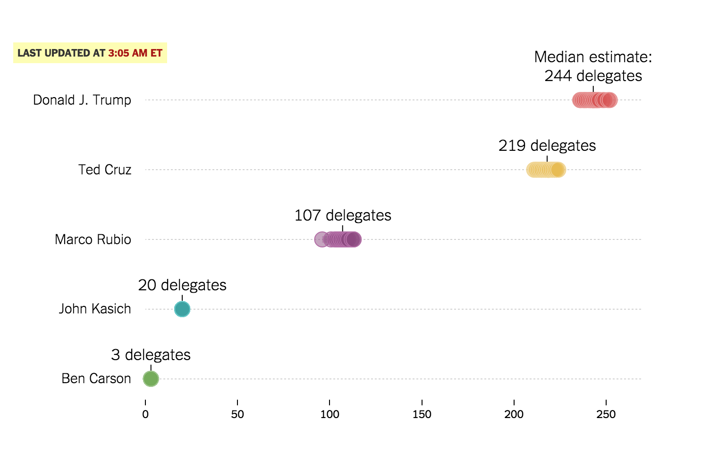

#Class 12: Grab Bag/Smorgasbord

## SF Class Notes

Today is our last class!

Hopefully you know how to get started with D3 and some of the idioms used in creating visualizations.

Let's do a brief review of some of the visualizations we've built along the way and share our project progress. Also check out this visualization of [rhyme patterns from the musical 'Hamilton'](http://graphics.wsj.com/hamilton/) along with [notes on how they made it](https://source.opennews.org/en-US/articles/hamilton-algorithm/).

How do you make gifs of visualizations? I use [Licecap](http://www.cockos.com/licecap/) because it's easy, but if you're comfortable with command line tools and want to make high-quality gifs check out [this workflow](http://bl.ocks.org/mbostock/4b88b250bc4439289d94).

##Final Project
#### Motion Chart
D3 Time Series Chart using Mike Bostock's [Wealth and Health of Nations] (https://bost.ocks.org/mike/nations/) chart as a template. Added interface elements - start button and slider. Click on image below to go to chart.
[] (http://bl.ocks.org/keboice/raw/037f7ac2089bbe455e86140d24bdefc9/)

#### Dancing Ansombe's
Press buttons to transition the plot

#### Baseball Scatterplot

#### Barley Boxplot by Ramesh

#### Dancing Barley Sites

#### Extended Barley Yield Small Multiples

#### Chicago Gun Imports

#### Playing with Projections - Science Satellites

#### Drought Small Multiples

#### Color Cycling Bars

#### Canvas Drawing with D3 Elastic Easing

#### Gooey Phyllotaxis with Blur

## Kevin's Class Notes

You're never done learning D3, and no class can teach you everything. Here, we'll go over some things many of you have asked about, with a variety of activities to choose from.

Node, Mobile, Fiddly Bits, New Layouts, Live applications?

Let's look at and discuss [another chart](http://www.nytimes.com/interactive/2016/03/01/upshot/super-tuesday-live-republican-delegate-estimates.html?rref=collection%2Fsectioncollection%2Fupshot&action=click&contentCollection=upshot&region=stream&module=stream_unit&version=latest&contentPlacement=2&pgtype=sectionfront) that we'll use today. It touches on many of these things.

Look at the inspector and find the data this is loading. We're interested in the simpler one, called `republican-sims.json`. [Download it](http://int.nyt.com/newsgraphics/2016-02-20-live-upshot-model/data/out/republican-sims.json) locally.

I got it started for you. Take a look at [example.html](example.html) and download it if you like. Get it running on your machine.

Let's discuss how this works.

We have five goals here that touch on many different aspects.

1. *Node* In real life we don't need to do any preprocessing, but it's easy to see how we might if the file were bigger. Let's use [Node.js](https://nodejs.org/en/) to render out a json file that includes the median, min and max projection for each candidate.

2. *Mobile* Let's get this guy looking good on a phone. What design decisions might we need to make? What technical considerations?

3. *Fiddly bits* Sad but true: the first 90 percent and the last 10 percent usually take the same amount of time. Try to match the design (or improve on it!), customizing colors, borders, axes and labels, adding to the function as necessary.

4. *New layouts* Interactivity can be hard, and possible not worth it, but there are ranges of it that could help. Something like [this](http://bl.ocks.org/ilyabo/1339996) is more or less free. But you could try to implement a [Voronoi layout](http://bl.ocks.org/mbostock/4060366). Lesson for any layout or example: get the demo working locally, remove unnecessary code, then tweak as necessary.

5. *Live applications* One of the only reasons this chart is fun is because it feels live. How might you build this with updates in mind?

What else?
